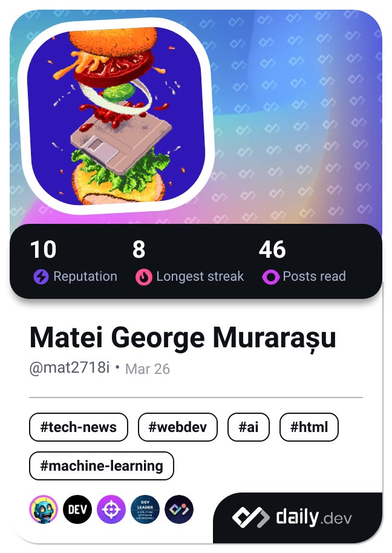

### Hi there 👋
I like to keep the dime on time, so here's a quick summary of myself :
 
😎 I'm eager, imaginative, thorough in details, enthusiastic about programming, and keen on exploring fresh opportunities to innovate, develop, and succeed in the realm of ICT. I'm thrilled to apply my creative mindset to uncovering and adopting novel solutions in a outside-the-box perspective.
🌱 Currently, I'm eagerly learning to becoming a Front End Engineer and Web Designer.
📫 You can reach me via the social media links posted just below my github account.

